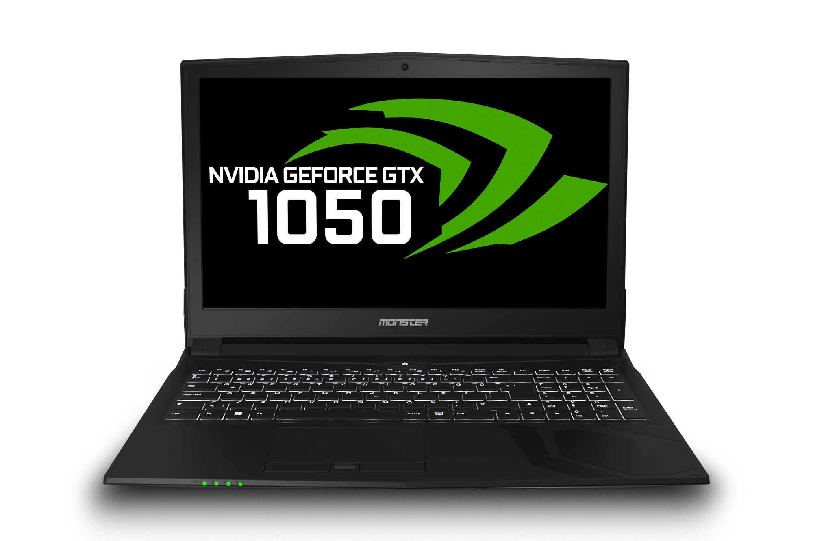

# Big Sur (11.1)

## Monster Abra A5 v9.1.2 Hackintosh

**1. Specs:**

* Intel i7 7700HQ 2.8Ghz Turbo 3.8Ghz
* HM175 Chipset
* 100 Series/C230 Series Chipset Family
* Intel HD Graphics 630
* Nvidia Geforce 1050M (disabled)
* Samsung 970 Evo Plus NVMe 500Gb
* Adata 8Gb 2133Mhz DDR4L
* Intel Dual Band 8265 Wireless
* Realtek RTL8168/8111 PCI Express Gigabit Ethernet
* Realtek RTL8411B PCI Express Card Reader
* Synaptics SMBus
* Synaptics TouchPad(TrackPad)
* Chicony Usb 2.0 Camera

* Stable Release
* You need to generate UUID and Serial from https://github.com/corpnewt/GenSMBIOS for iCloud Services.
